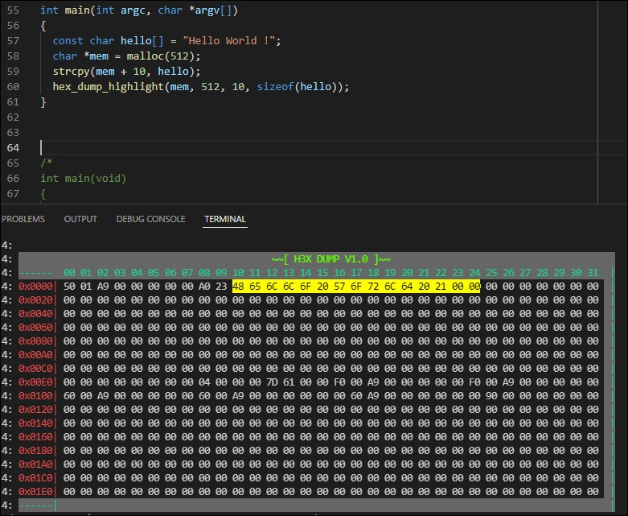

# hexdump
printf utility i use to debug memory related c softwares.

this utility uses [escape sequence](https://en.wikipedia.org/wiki/ANSI_escape_code#Colors) for coloring, use it with modern terminal.

# quick start
code usage:
```c
#include "hexdump.h"
int main(int argc, char *argv[])
{
  const char hello[] = "Hello World !";
  char *mem = malloc(512);
  if (NULL != mem){
    strcpy(mem + 10, hello);
    hex_dump_highlight(mem, 512, 10, sizeof(hello));
    free(mem);
  }
}
```


# pictures



